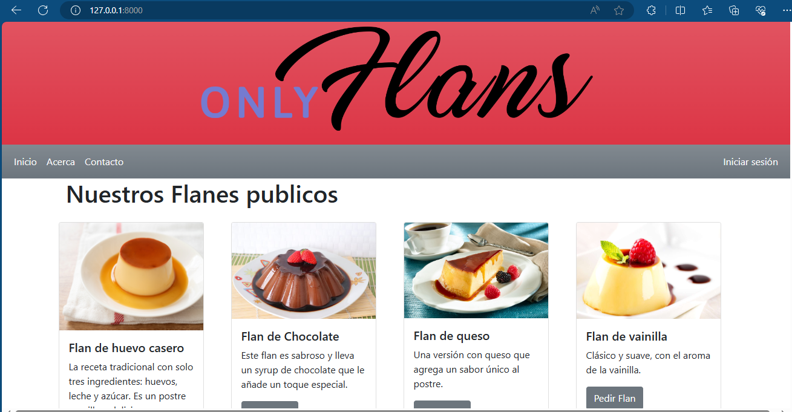

# Proyecto Onlyflans

Este proyecto tiene como finalidad crear una pagina web para una pyme de postres.

Los requqrimientos son:

- Pagina Base
- Pagina Inicio
- Pagina acerca
- Formulario de contacto
- Pagina login

Todas las paginas deben basarse en la base y solo cambiar el contenido

A continuación se dejan capturas del proyecto:

